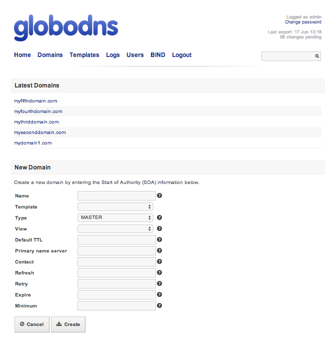
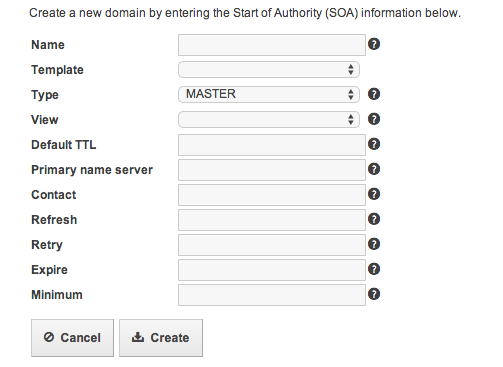
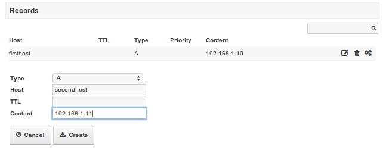
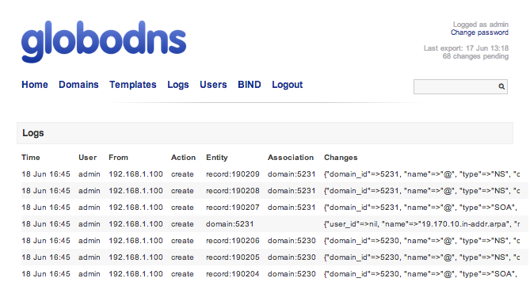
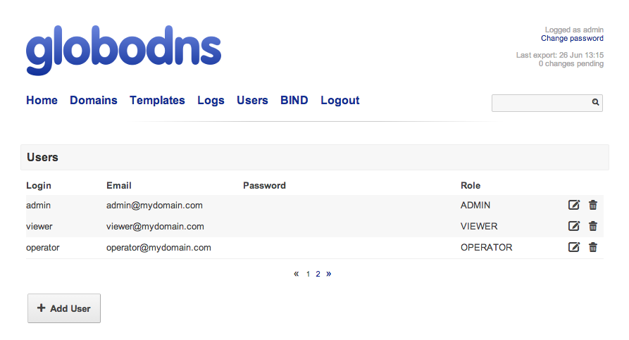
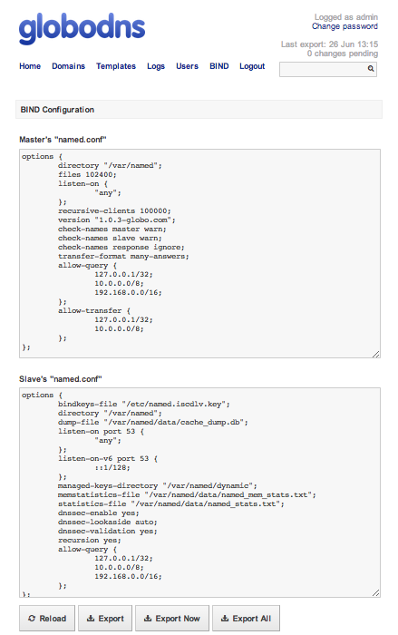

# Abstract

Once you have successfully setup your environment, you can manage your domains/records entries from the UI or using the [API](https://github.com/globocom/Dns-Api/wiki/API). In this page, you can find some operations that can be done from the UI. For details on API calls to manage domains and records, please [click here](https://github.com/globocom/Dns-Api/wiki/API).

## Home

Logged in as admin, the home page shows a list of recently created domains (and reverse domains) and offers a quick shortcut for creating a new domain.

## Domains

The domain page shows a full list of the domains available at the Bind server, ordered alphabetically. Alternatively, you can click on the *reverse* button on the bottom right corner of the page to show reverse domains.

At the bottom of the page, you can click on the *Add Domain* button to create a new domain on the Bind server. To create a new domain, it is possible to select a template, which will fill in all required parameters except name.

Otherwise, it is necessary to manually insert the parameters for the new domain, such as type, TTL, expiration time etc.

When you click in a domain, the UI presents details for that domain along with its records list. At this moment, it is possible to edit the domain details, add and remove records or delete the domain.

To add a new record to a domain, simply click on the *Add Record* button.

## Templates

In this page, you can set up a template for domains (DNS zones), providing default values for several parameters, such as:

* Default TTL
* Primary name server
* Contact
* Refresh
* Retry
* Expire
* Minimum

Note that, after you create a domain template, you can also insert some default records.

## Logs

The logs page provides every action performed on Dns-Api, listed chronologically. Each entry shows who has requested which action, at what time, along with details for that action.

## Users

This page lists every user registered to access Dns-Api, along with its role. There are three possible roles:

* **viewer**: this is a read-only role. Users with this role can list domains and records.
* **operator**: this is a management role. Users with this role can list, create, edit and remove domains, records and templates, read logs and export records.
* **admin**: this is an administration role. Users with this role can do everything an operator can, plus list, create, edit and remove users, export maps and reload the Bind server.

At the bottom of the page, click on the *Add User* button to add a new user, providing an unique username, e-mail, password and role.

## BIND

This page shows the *named.conf* file registered on the database and exported to both the master and the slave DNS servers. It allows an administrator to edit this configuration and export to the Bind server.

At the bottom of the page, 4 options are offered:

* **Reload**: this action sends the HUP signal to the Bind server, reloading all configurations.

* **Export**: this action includes the new configurations to the next scheduled export to the Bind server.

* **Export Now**: this action exports the new configurations immediately and reloads the Bind server.

* **Export All**: this action gets all the configuration from the database, creates every necessary file and exports them to the Bind server.